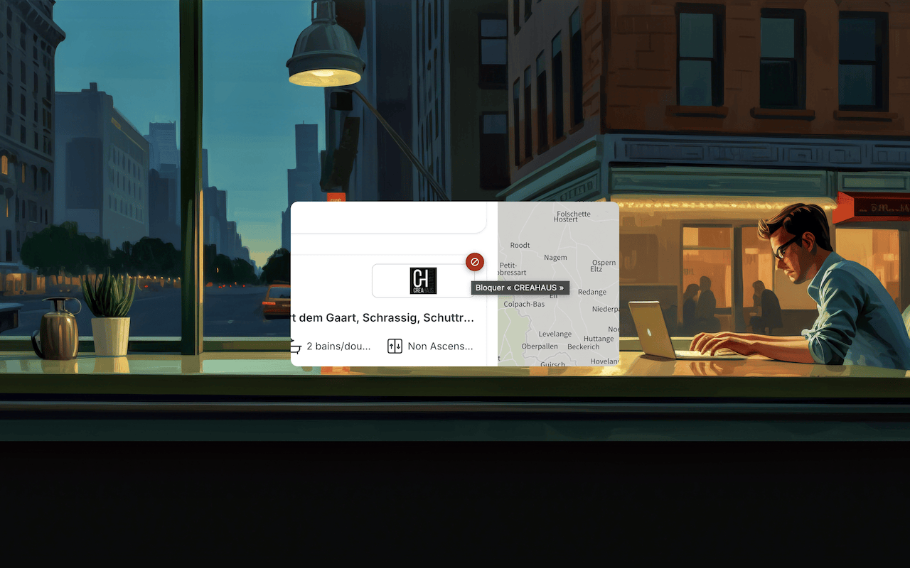
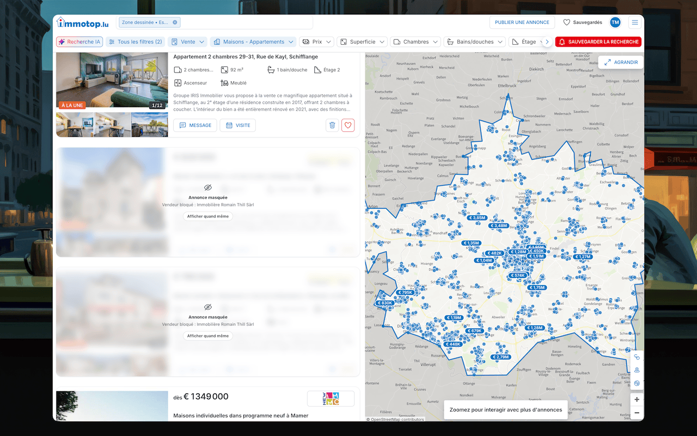
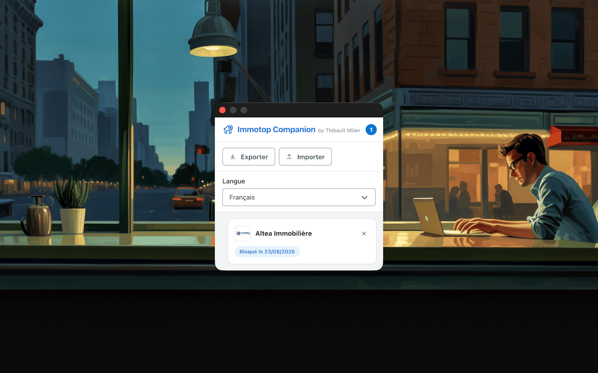

# Immotop Companion

Extension Chrome (Manifest V3) qui permet de masquer, sur les résultats de recherche
[immotop.lu](https://www.immotop.lu), toutes les annonces d'un vendeur professionnel ou d'une
agence en un clic. Construite avec [Vite](https://vitejs.dev), [@crxjs/vite-plugin](https://crxjs.dev)
et [Web Awesome](https://webawesome.com) pour l'UI du popup.

> Projet non-officiel, non affilié à immotop.lu.

## Aperçu

<table>
  <tr>
    <td width="33%">
      
      <br />Un bouton apparaît au survol du logo d'une agence.
    </td>
    <td width="33%">
      
      <br />Les annonces du vendeur bloqué sont floutées, pas supprimées.
    </td>
    <td width="33%">
      
      <br />Le popup liste, exporte et importe les vendeurs bloqués.
    </td>
  </tr>
</table>

## Fonctionnement

- Sur une page de résultats de recherche, un petit bouton apparaît au survol du logo de chaque
  agence/vendeur professionnel (les annonces de particuliers, sans logo, ne sont pas concernées).
- Un clic sur ce bouton ajoute le vendeur à la liste de blocage. Ses annonces restent visibles sur
  la page mais sont floutées, avec un message indiquant le vendeur bloqué et un bouton "Afficher
  quand même" pour la révéler ponctuellement (un toast avec "Annuler" apparaît aussi en bas de
  l'écran juste après le blocage).
- Le vendeur est identifié par l'image de son logo (unique par vendeur), pas par son nom, ce qui
  évite les faux positifs entre agences aux noms proches.
- Les nouvelles annonces chargées dynamiquement (défilement infini, changement de page) sont
  automatiquement floutées si elles appartiennent à un vendeur déjà bloqué.
- Le popup de l'extension (icône dans la barre d'outils) est organisé en deux onglets :
  - **Annonces** : liste des vendeurs bloqués, avec possibilité de retirer un vendeur de la liste
    (ses annonces redeviennent visibles) ;
  - **Réglages** : export/import de la liste au format JSON, choix de la langue de l'interface
    (Français, Deutsch, English, Português, Lëtzebuergesch), et la synchro smartphone (voir
    ci-dessous).
- La langue est auto-détectée à partir du navigateur au premier lancement, mais peut être forcée
  manuellement dans le popup ; le choix est mémorisé et s'applique instantanément à la popup et aux
  éléments injectés sur immotop.lu (bouton de blocage, overlay flouté).

### Synchro smartphone (optionnelle)

immotop.lu propose son propre bouton natif "masquer" sur chaque annonce (icône corbeille), lié au
compte utilisateur et donc synchronisé entre le site et l'app mobile — contrairement au masquage de
l'extension, qui n'agit que dans ce navigateur. Activable dans l'onglet **Réglages** du popup, la
synchro smartphone clique automatiquement ce bouton natif pour chaque annonce d'un vendeur bloqué,
afin qu'elle disparaisse aussi de l'app mobile.

- **Nécessite d'être connecté** à son compte immotop.lu : le réglage est désactivé et un message
  l'explique tant que l'extension n'a pas détecté de session active sur immotop.lu (il faut avoir
  un onglet immotop.lu ouvert, connecté, pour que l'état soit détecté). Si la session se termine
  pendant que la synchro est active, elle est automatiquement désactivée.
- **Fonctionnement différent du masquage de l'extension** : l'action est liée au compte immotop.lu
  (pas seulement à ce navigateur) et n'est pas annulée automatiquement quand on débloque un vendeur
  dans l'extension. Pour restaurer les annonces masquées côté immotop.lu, il faut se rendre sur
  [la page des annonces masquées du compte](https://www.immotop.lu/utente/annunci/nascosti/) —
  l'extension y renvoie via un lien affiché au moment du déblocage.
- **Restauration assistée** : sur cette page des annonces masquées, l'extension repère celles qui
  appartiennent à un vendeur récemment débloqué et affiche une bannière avec un bouton pour les
  restaurer d'un coup, plutôt que de devoir les retrouver une par une parmi toutes les annonces
  masquées. Comme la page charge ses résultats au fur et à mesure (défilement infini, pagination),
  le bouton reste actif et se met à jour à mesure que de nouvelles annonces du même vendeur
  apparaissent, jusqu'à ce que la bannière soit fermée manuellement.

## Développement

```bash
npm install
npm run dev
```

## Build

```bash
npm run build
```

Charger ensuite le dossier `dist/` dans Chrome via `chrome://extensions` → mode développeur →
"Charger l'extension non empaquetée".

## Structure

- `manifest.json` — manifeste de l'extension (MV3)
- `src/popup/` — popup de l'extension : liste des vendeurs bloqués, export/import (HTML + Web Awesome)
- `src/background/` — service worker (met à jour le badge avec le nombre de vendeurs bloqués)
- `src/content/` — content script injecté sur immotop.lu : détecte les logos d'agences dans les
  résultats de recherche, ajoute le bouton de blocage et masque les annonces bloquées
- `src/shared/storage.js` — accès partagé à `chrome.storage.local` (liste des vendeurs bloqués,
  réglage de la synchro smartphone, état de connexion immotop.lu détecté par le content script)
- `src/shared/i18n.js` — traductions (FR/DE/EN/PT/LB), détection de la langue du navigateur et
  préférence de langue stockée dans `chrome.storage.local`
- `public/icons/` — icônes de l'extension (générées depuis `design/icon.svg`)

## Contribuer

Les bugs, idées et pull requests sont les bienvenus — voir [CONTRIBUTING.md](CONTRIBUTING.md).
Pour signaler un problème ou proposer une fonctionnalité, ouvre une
[issue](https://github.com/clawfire/immotop-companion/issues/new/choose).

## Auteur

Développé par [Thibault Milan](https://thibaultmilan.com).

## Licence

Distribué sous licence [CC BY-NC-SA 4.0](LICENSE) (Attribution - Pas d'utilisation commerciale -
Partage dans les mêmes conditions) — usage et modification libres pour tout ce qui n'est pas
commercial, à condition de créditer l'auteur et de partager les versions modifiées sous la même
licence. Pour un usage commercial, contacte l'auteur.
